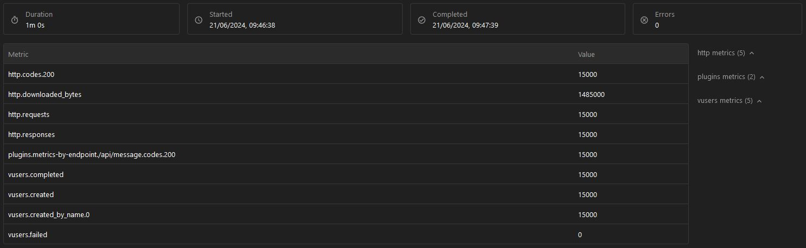

## RESTful API para el manejo de miles de Post Requests
# Naranja X 🙌

Esta sencilla Api cuenta con una única ruta de post junto a sus respesctivos test

## Correr la aplicacion en local 

Ejecuta npm install para instalar las dependencias. Se requiere tener el servicio de Redis instalado y funcionando.

```bash
npm install
```
Ejectutar el servidor

```bash
npm run dev
```

# Descripcion de lo realizado ✌

## Problema

Se solicito desarrollar una API capaz de manejar un alto volumen de peticiones POST con solo 2 datos, asegurando que todas las respuestas devuelvan el código 200.

## Solucion

Para recibir los datos de manera instantane y no generar un bottleneck con la base de datos, toda la información enviada será almacenada en Redis por el transcurso de 2 días.

Para el **servidor** se utilizo Node con Express y Typescript que brinda una solucion rapida y facil para construccion de Server APIs. Se creó un único endpoint, que recibirá un nombre de usuario y un mensaje a través del body. Luego se hicieron 2 simples pruebas utilizando Jest y Artillery para simular distintos escenarios de uso con 1000, 6000 y 15000 requests en un plazo de 1 minuto.

* Servidor
  * NodeJS
  * Express
  * dotenv
  * uuid
  * redis


## Test 

### Jest

Jest no está pensado para realizar pruebas de estress, por que lo relicé 2 sencillas pruebas utilizando ciclos for para simular un flujo continuo de 1000 y 6000 nuevos usuarios.

Correr los tests
```bash
npm run jtest
```
### Artillery

Artillery cuenta con pruebas de estres que simulan multiples usuarios realizando peticiones en simultaneo, en este caso se realizaron 15000 peticiones en el transcurso de 60 segundos. Luego la información es guardada en un json y se muestran las estadísticas a través de un archivo HTML. Para correr este test, previamente tiene que estar funcionando el servidor.

Ejectutar el servidor
```bash
npm run dev
```
Correr el test
```bash
npm test
```




Si llegaste aqui, muchas gracias y Buen Dia!